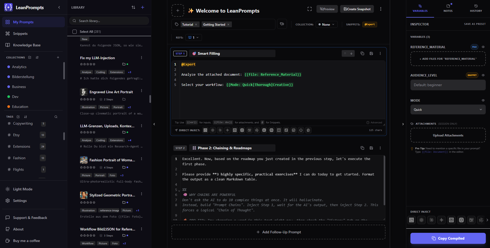
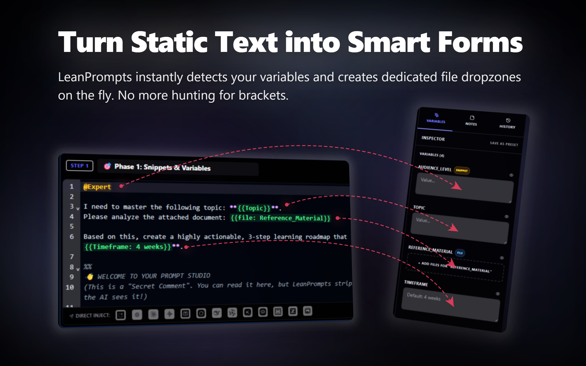
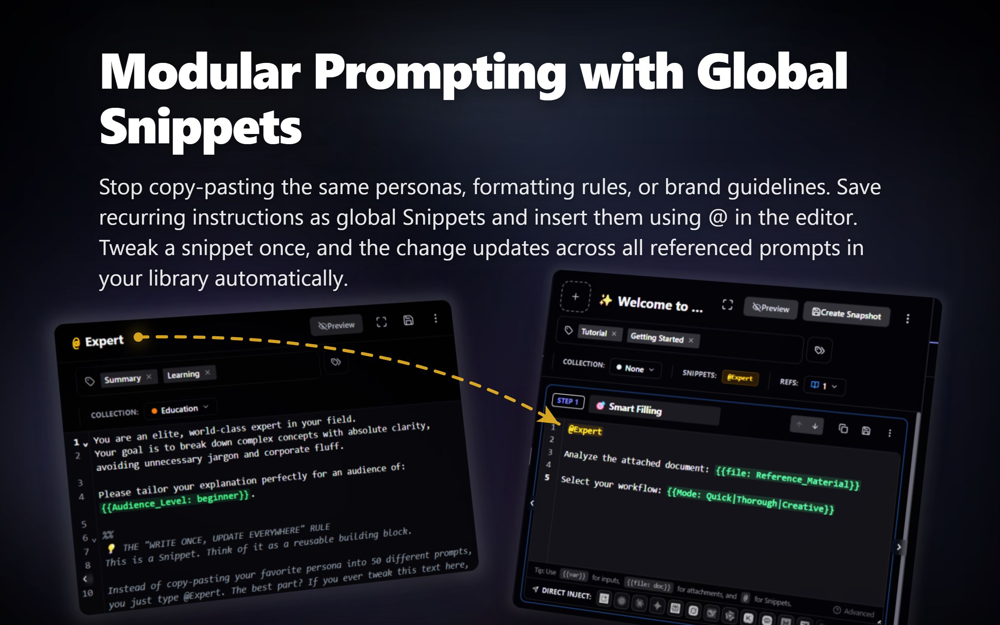
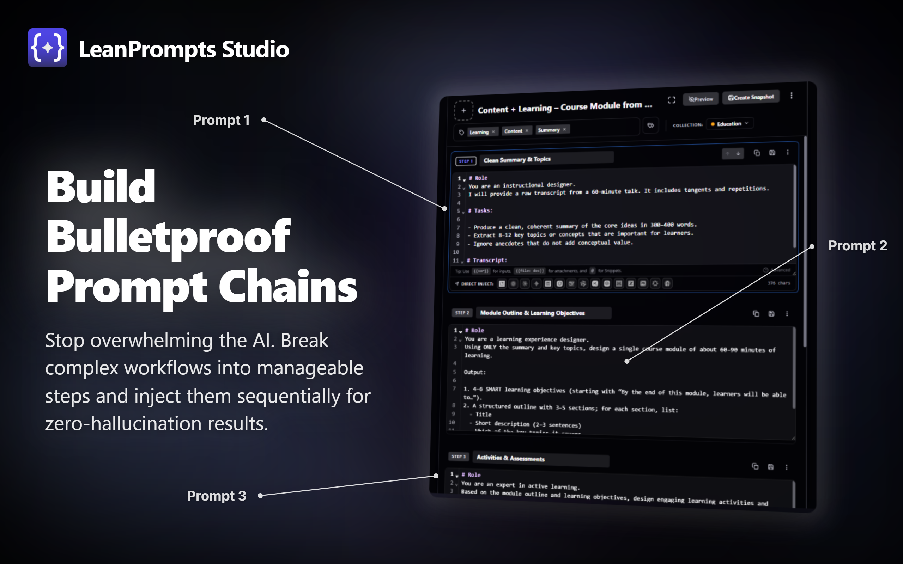
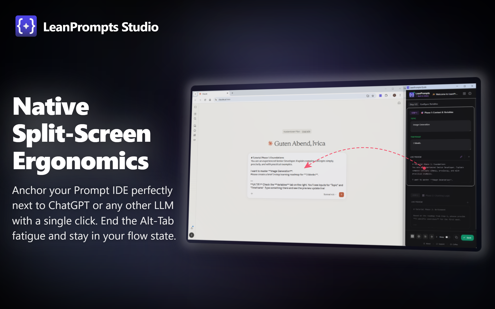
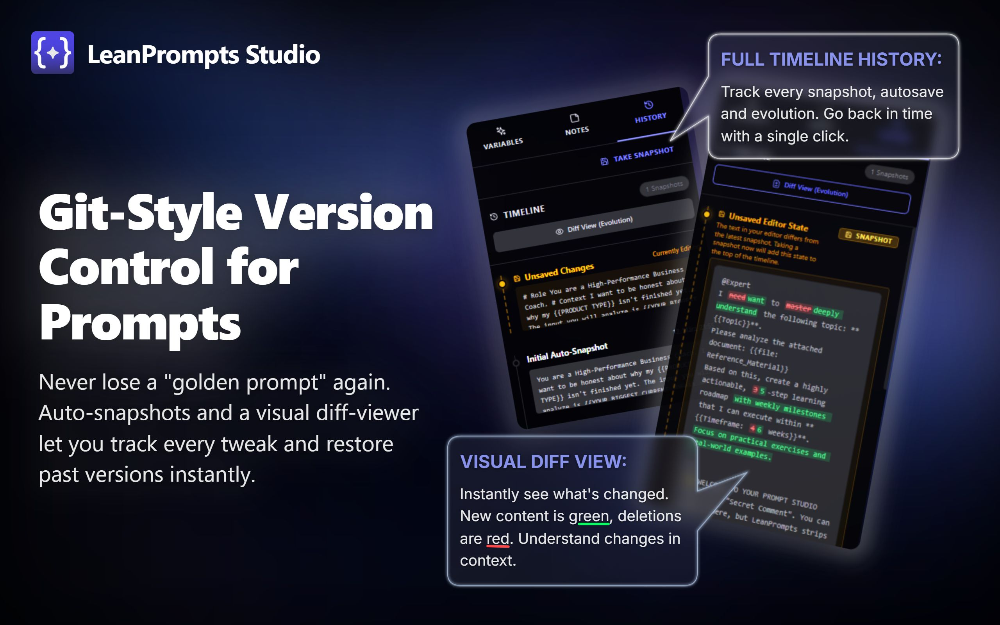

  <!-- Logo -->
  

  <h1>LeanPrompts Studio</h1>

  <h3>Stop typing prompts. Start engineering them.</h3>
  
  

    The professional, local-first Integrated Development Environment (IDE) for AI. 
    Build dynamic templates, chain logic, attach files, and inject everything directly into <em>any</em> LLM.
  

  

    
    
    
    
  

  

    <strong>Compatible with all Chromium-based browsers:</strong> 
    <em>Chrome, Edge, Brave, Opera, Vivaldi, Arc, and more.</em>
  

   

  <!-- Hero Screenshot -->
  

 

> **The painful truth:** If you manage your AI templates in Notion, Google Docs, or scattered text files, your workflow is broken. Hunting for `[INSERT TOPIC]` brackets, manually dragging the same context files into chats, and constantly switching tabs bleeds your cognitive energy. You're treating AI like a search engine, when you should treat it like an execution engine. **LeanPrompts is the cure.**

---

### 🤖 Supported Ecosystems & Universal Fallback

LeanPrompts' injection engine is optimized for major AI platforms, safely bypassing their React/Vue state-locks and Shadow DOM boundaries:

**ChatGPT • Claude • Gemini • DeepSeek • Perplexity • Grok • Meta AI • Mistral • Qwen • Poe • Kimi • Google AI Studio • MiniMax • Z.ai • and most other web-based LLM interfaces**

*   **Universal Detection:** If an AI interface is not listed, the engine's adaptive fallback will automatically locate the input field.
*   **Manual Selector:** Use the "Point & Click" connection mode to manually bind LeanPrompts to any custom or internal text field.
*   **Local AI:** Full offline support for local Web-UIs like Ollama, LM Studio, and Jan.ai.

---

## 💰 Zero API Keys. Zero Token Bills.

Most advanced prompt managers on the market are API-based wrappers. This means you pay per token for every long conversation, or you are forced to pay for expensive third-party SaaS subscriptions that act as middlemen. 

LeanPrompts works on a fundamentally different principle:
*   **Zero Token Costs:** Run highly complex prompt templates and multi-step chains directly on top of the **free web interfaces** of ChatGPT, Claude, DeepSeek, Gemini and others. 
*   **Keep Native Features:** Don't lose access to native platform tools like Claude's *Artifacts*, ChatGPT's *Advanced Data Analysis*, or Gemini's *Gems*—features that are usually stripped away when using raw API clients.
*   **Local Privacy at Zero Cost:** Get premium, enterprise-grade IDE workspace features without paying a single cent in recurring subscription fees.

---

## 🛑 The "Copy-Paste" Bottleneck is Dead

AI is incredibly powerful, but our interfaces are painfully primitive. If you use LLMs professionally on a daily basis, you know the friction intimately:

*   ⛔ **The "Placeholder" Grind:** You copy a massive template into ChatGPT, then manually scan a wall of text to find brackets. You make a typo. The context breaks.
*   🏓 **The "Alt-Tab" Tax:** Constantly bouncing between your prompt repository, your source files, and the AI interface shatters your focus.
*   🧩 **Fragmented Logic:** Managing a multi-stage "Chain of Thought" manually across 15 open tabs leads to severe "AI drift".
*   📁 **Attachment Amnesia:** Dragging the same three reference PDFs into a new chat session for the fifth time today is a massive waste of time.

Standard "text expanders" only treat the symptoms. They just spit raw text onto your clipboard. They don't understand your variables. They don't handle your files. 

**The "Copy-Paste" era is over. It's time to upgrade your engine.**

---

## 🟢 Enter the Dynamic Orchestrator

LeanPrompts fundamentally changes how you interact with LLMs by separating prompt design from runtime execution.

### ⚡ Technical Execution in 3 Steps:

1. **Abstract Form Generation 🎯:** When you open a template, LeanPrompts parses the code for variables and generates a clean data-entry UI in the inspector sidebar. If your prompt contains `{{Topic}}`, it renders a text field. Pipes (`{{Mode: Quick|Thorough}}`) build dropdown-enums, and `{{file: Reference_Material}}` maps to a localized dropzone.
2. **Context Compilation 🏗️:** While you fill out the fields, the compile-engine dynamically processes your inputs, resolves central `@Snippets` (e.g. brand voice, coding rules), and stages binary file attachments without mutating your source templates.
3. **DOM-Level Injection 🚀:** Clicking the target LLM icon triggers the deep injection engine. It bypasses the system clipboard, directly populates the site's rich-text framework, programmatically uploads attachments via synthetic `DataTransfer` sequences, and executes the prompt.

---

## 🧱 Modular Prompting with Global Snippets

Stop copy-pasting the same personas, formatting rules, or brand guidelines. Save recurring instructions as global, reusable Snippets.

*   **DRY (Don't Repeat Yourself) Architecture:** Reference central components using `@` inside the editor. Any change made to a global snippet automatically propagates through all dependent prompt templates in your database.
*   **Variable Bubbling:** Snippets can contain their own variables (such as `{{Audience_Level}}` inside `@Expert`). At compile-time, the parser extracts these nested variables and bubbles them up to the main input form.

---

## 🎛️ The Command Center (Feature Arsenal)

LeanPrompts gives you absolute control over your AI interactions. Here is what makes it a true IDE:

### 🛠️ The Workspace
| Feature | Function |
| :--- | :--- |
| `{{ }}` **Smart Variables** | Generates tailored UIs. Use `{{Name}}` for text inputs, `{{Tone: A \| B}}` for **Dropdowns**, and `{{file: Briefing}}` for dedicated **File Dropzones**. |
| `{{! }}` **Required Fields** | Enforces input safety. Prefix a variable with an exclamation mark (e.g., `{{!Target_Audience}}`) to block injection and highlight empty fields in amber until filled. |
| `@` **Global Snippets** | Reusable logic blocks. Change `@BrandVoice` once, and it updates in all 50 prompts using it. |
| ⛓️ **Prompt Chains** | Break complex tasks into logical steps. Inject Step 1 (Analyze), wait for output, then inject Step 2 (Execute). |
| 🤫 **Secret Comments** | Use `%%`, `//`, `/* */`, or `<!-- -->` to write internal notes in your prompt. LeanPrompts strips them out before injection. |
| 🌓 **Native Split-Screen** | One click to automatically align the LeanPrompts Sidebar side-by-side next to your LLM browser window. Zero Alt-Tabbing. |
| 📚 **Knowledge Base** | A built-in, Markdown-capable "Second Brain" for AI. Document model quirks, save best practices, and use `[[WikiLinks]]`. Supports unencrypted local image embeds. |
| 🗂️ **Collections & Bulk** | Organize hundreds of prompts with color-coded Collections, multi-tags, and a robust Bulk-Action engine. |
| ⚠️ **Clipboard Fallback UI** | If direct browser injection is blocked by target site CSP, LeanPrompts auto-copies the prompt and triggers a visual fallback instruction. |

### 🔬 The Inspector (Sidebar)
| Tab | Function |
| :--- | :--- |
| **Variables & Files** | Your active form. Fill data, drop files, and save the exact state as a **Preset** for 1-click recall later. Supports Base64 file serialization. |
| **Notes** | A dedicated local scratchpad to document context or link to your internal Knowledge Base using autocomplete `[[WikiLinks]]`. |
| **Time Machine (Diff-View)** | Intelligent Auto-Snapshots protect your baseline before major edits. Freeze versions manually, compare changes via a **Git-style Code Diff Viewer**, and restore instantly. |
| **Beautiful Exports** | Export any prompt as a clean Markdown file, a JSON bundle, or a **high-res PNG image** to share on social media. |
| 🛡️ **Import Rollback (Undo)** | Creates an automatic safety snapshot before imports. Revert accidental or conflicting imports with a **1-Click Rollback**. |

---

## 🌍 Real-World Scenarios (Are you one of us?)

LeanPrompts is engineered for digital professionals. If you recognize the pain in these scenarios, this tool was built for you:

### 1. The Agency Marketer (Scaling Brand Consistency) 🗣️
*   **The Pain:** You manage 5 different clients. You copy a massive prompt into Claude, hunt down `[INSERT BRAND TONE]`, and manually type it out. You miss one bracket or use the wrong tone-of-voice document. The output is useless.
*   **The Lean Way:** You store brand guidelines as global `@Snippets` (e.g., `@{Tone_Nike}`). You write a master template: `Topic: {{Topic}}. Persona: @{Tone_Nike}`. Fill out the "Topic" field, save it as a **Preset**, and hit inject. Zero risk of hallucinations or using the wrong voice tomorrow.

### 2. The Senior Developer (Context-Heavy Code Reviews) 💻
*   **The Pain:** You manually drag `legacy_code.js`, `style_guide.md`, and `database_schema.json` into the ChatGPT window every single time you start a new review session.
*   **The Lean Way:** You create a prompt: `Review this code. \n Code: {{file: SourceCode}} \n Rules: {{file: Guidelines}}`. You attach your rule-files *once*. Every time you click "Inject", LeanPrompts physically takes over, dropping the exact files into the AI's upload zone natively.

### 3. The Prompt Engineer (Taming Complexity) 🧪
*   **The Pain:** You paste a giant, 1000-word list of instructions into an LLM at once. The AI gets confused, ignores constraints, and skips crucial steps.
*   **The Lean Way:** You build a **Prompt Chain**. *Step 1: Extract Data. Step 2: Critique logic. Step 3: Format Output.* You inject Step 1, wait for the AI's output, then inject Step 2. You force the model to maintain a structured step-by-step contextual processing.
 

 

### 4. The Model Evaluator (Cross-Testing) ⚖️
*   **The Pain:** You built a complex prompt with 5 variables and 3 PDF attachments. You want to see which model produces the best result. Opening OpenAI, Anthropic, Google, and DeepSeek tabs, pasting the text four times, and manually re-uploading the 3 PDFs everywhere is exhausting.
*   **The Lean Way:** You configure your variables and attach your files *once* in the LeanPrompts Inspector. Then, you simply click your configured LLM icons one after the other. LeanPrompts natively injects the exact same text and files into every model instantly.

### 5. The Recruiter / Data Analyst (Persistent File Presets) 📎
*   **The Pain:** You screen 50 resumes a day against the exact same Job Description. Every single time you start a new chat, you have to manually upload the `Job_Description.pdf` AND the new `Candidate_Resume.pdf`. It’s tedious.
*   **The Lean Way:** You write: `Score this candidate: {{file: Resume}} against our requirements: {{file: Job_Description}}`. You attach the Job Description PDF *once* and save the state as a **Preset**. Now, you just load the preset, drag the *new* resume into the empty dropzone, and hit inject. Half the upload work is fully automated.

### 6. The Flow-State Coder (Split-Screen Ergonomics) 🌓
*   **The Pain:** You are deep in your code editor. You Alt-Tab to your notes, Alt-Tab to ChatGPT, Alt-Tab back to copy your code. Your focus is shattered by endless window management.
*   **The Lean Way:** You open the LeanPrompts Quick Popup and click the **Split-Screen** icon. The window manager communicates with the OS to split your screen: Your target LLM window on the left, and the LeanPrompts popup sidebar locked to the right margin.
 

 

### 7. The Panic Restorer (Visual Diff-View) 🕒
*   **The Pain:** You spent an hour engineering a complex prompt. You tweak a few sentences to "optimize" it. Suddenly, the AI output is absolute garbage. You try to remember what you changed, but your text editor doesn't have a history.
*   **The Lean Way:** You open the **History tab**. The automatic snapshot engine captures the exact state of your steps before manual edits, while the visual diff viewer tracks changes on a character level. Click "Load to Editor" to rollback instantly.
 

 

### 8. The Academic Researcher (Deep Extraction Chains) 🎓
*   **The Pain:** You upload a 100-page research paper and ask the AI to "Find all claims about X and format them as APA citations." The AI gets overwhelmed, misses half the claims, and formats them wrong.
*   **The Lean Way:** You combine Files + Chains. 
    *   *Step 1:* `Extract all claims about X from {{file: Paper}}`. (AI focuses only on reading). 
    *   *Step 2:* `Verify these claims against the text`. (AI focuses on accuracy). 
    *   *Step 3:* `Format the verified list as APA citations using @APA_Rules`. (AI focuses on formatting). You get reliable results every time.

### 9. The Enterprise Consultant (Corporate Compliance) 🛡️
*   **The Pain:** You work for a corporation or law firm. You are strictly forbidden from using API-wrappers or 3rd-party tools because they route sensitive client data through their own cloud servers. You *must* use your company's secure Enterprise ChatGPT account.
*   **The Lean Way:** LeanPrompts is a local orchestrator, not a middleman. It stores your templates in your browser and physically types them *directly into your approved Enterprise chat window*. Zero data leaves your machine. You get pro-level IDE features while staying aligned with strict GDPR and corporate IT-Security guidelines.

### 10. The Expert Handover (Workflow Bundles & Smart Merge) 🤝
*   **The Pain:** You engineered the perfect workflow for your team. You share it as a messy Google Doc. They accidentally delete half the instructions and complain the AI doesn't work.
*   **The Lean Way:** You export the specific prompt as a **Workflow Bundle**. LeanPrompts packages your prompt, all attached `@Snippets`, file dropzones, and linked `[[Knowledge Base]]` guidelines into a single JSON file. When your colleagues import it, the **Smart Merge Engine** integrates everything seamlessly, auto-detects namespace conflicts (appending an `(imported)` suffix), and offers a **1-click Rollback** if an import needs to be cleanly reversed.

---

## 🔒 Privacy, Security & Trust (100% Local-First)

Handing over your proprietary prompt library feels risky. LeanPrompts is designed for professionals handling NDAs, proprietary code, GDPR requirements, and sensitive client data.

*   **No Cloud Servers:** LeanPrompts has no backend database. Zero API calls send your prompts to a remote server.
*   **IndexedDB Storage:** All prompts, snippets, files, and history states live exclusively inside your browser's local sandbox, protected by Chromium's **Same-Origin Policy (SOP)**.
*   **100% Offline Workflows (Local AI):** Working with highly confidential data under strict NDAs? LeanPrompts natively supports local, open-source models. Simply add your local Web-UI (like Ollama, LM Studio, or Jan.ai) to the Quick Launch settings and orchestrate your prompts entirely offline — without a single byte ever leaving your machine or network. LeanPrompts explicitly permits unencrypted `http://` connections for localhost/local-IP addresses.
*   **No Tracking:** Zero web analytics (no Google Analytics, no tracking pixels).
*   **No API Keys Required:** It acts as an *orchestrator*, utilizing your existing, authenticated browser sessions (like your ChatGPT Plus sub). No keys to leak.
*   **RAM-Guard Protection:** A built-in 100MB batch limit on attachments prevents browser Out-Of-Memory (OOM) crashes during Base64 file serialization.
*   **Local Favicon Vectors:** To prevent leaking internal local-network hostnames to external DNS/Google favicon servers, LeanPrompts generates offline vector fallbacks for localhost/private IP ranges.

---

## ❓ Frequently Asked Questions (FAQ)

**Q: Is LeanPrompts completely free? Do I need API keys?**  
A: The **LeanPrompts Local Core** is 100% free and open-source. You do not need API keys, as it operates directly on top of your existing browser sessions (like ChatGPT Plus or Claude Pro).   
*Note on the future:* To sustain the long-term development of this project, I am planning to introduce an optional **Pro/Teams version** later. This will include cloud-sync across devices and collaborative team workspaces. However, the private, local-first version you download today will **always remain free**.

**Q: How is this different from basic Text Expanders (like TextBlaze or espanso)?**  
A: Basic text expanders are "dumb" clipboards that just spit raw text onto your screen, which modern AI interfaces often ignore or format incorrectly. LeanPrompts is a dynamic orchestrator powered by a **Deep Injection Engine**. It safely bypasses strict React/Vue state-locks and pierces closed Shadow DOMs to natively trigger the website's internal events. This allows it to flawlessly automate complex prompt chains and programmatically upload your files (PDFs, Images) exactly as if a human had interacted with the page.

**Q: Why not just use TypingMind or other API wrappers?**  
A: API wrappers force you to pay per token, manage API keys, and you lose access to native UI features like Claude's *Artifacts* or ChatGPT's *Advanced Data Analysis*. LeanPrompts gives you a pro-level IDE workflow while letting you keep the feature-rich, native web interfaces you already pay for.

**Q: What happens if ChatGPT or Claude completely changes their UI?**  
A: Extensions can be fragile, but LeanPrompts is built defensively. If a site updates its interface and the automated injection fails, you can use the built-in **"Point & Click" Manual Override**. Just click the target input field, and the engine will instantly map itself to the new layout so you can keep working immediately.

**Q: Can I really automate file uploads like PDFs or Images?**  
A: Yes. By simply typing `{{file: Document}}` anywhere in your prompt, LeanPrompts creates a dedicated Dropzone in your sidebar. When you inject, the engine constructs native `DataTransfer` objects to programmatically upload your files, exactly as if you had dragged and dropped them yourself. It even inserts the filename into the text automatically!

**Q: How do I sync my prompts between my desktop and laptop without a cloud?**  
A: To guarantee absolute privacy and zero data leaks, there is no automatic cloud sync. Simply go to `Settings > Data Backup` and export a "Full System Backup". You can securely transfer this single JSON file to your other device (via USB, local network, or secure drive) and import it via our Smart Merge Engine.

**Q: Since it's a browser extension, are my prompts exposed to the websites I visit?**  
A: No. Even though LeanPrompts lives inside your browser, it acts as a completely isolated local app. Your data is stored securely in the `chrome-extension://` origin, which is strictly walled off by the browser's Same-Origin Policy (SOP). This means no website you visit on the internet, even malicious ones, can read your extension's IndexedDB. Furthermore, LeanPrompts uses strict Manifest V3 Content Security Policies (CSP) to prevent Xsite scripting (XSS), and even other installed extensions cannot access your data. Your prompts are as secure as the physical hard drive of your computer.

**Q: What happens if a database import goes wrong or overrides my local work?**  
A: LeanPrompts includes an **Import Safety Net**. Right before any import process, the app automatically creates an offline **Safety Snapshot** in your local database. If anything looks wrong or if you accidentally imported duplicate work, simply head to your Import History in Settings and trigger a **1-Click Rollback** to cleanly restore your library to its exact previous state.

**Q: Am I locked into your ecosystem?**  
A: Zero vendor lock-in. You can export your entire library (prompts, version histories, snippets, step notes, and custom settings) as a clean, human-readable JSON file at any time. Your data belongs to you.

**Q: Can I use LeanPrompts completely offline with a local AI model (like Llama 3 or Mistral)?**  
A: Yes, absolutely. You can add any local Web-UI — such as Open WebUI for Ollama, LM Studio, or GPT4All — to your LLM Quick Launch list in the Settings. LeanPrompts explicitly allows unencrypted `http://` connections for local addresses (e.g., `http://localhost:8080` or `http://127.0.0.1`). The generic injection engine will then automatically locate your local chat interface and inject your prompts, creating a 100% offline workflow for sensitive data. No internet connection required.

---

## ⌨️ Keyboard Mastery

I built LeanPrompts for speed. Keep your hands on the keyboard. *(Configure globally in `chrome://extensions/shortcuts`)*.

| Command | Windows / Linux | Mac | Action |
| :--- | :--- | :--- | :--- |
| **Quick Popup** | <kbd>Alt</kbd> + <kbd>Shift</kbd> + <kbd>Q</kbd> | <kbd>⌥</kbd> + <kbd>⇧</kbd> + <kbd>Q</kbd> | Open the Quick Access launcher popup. |
| **Open Studio** | <kbd>Alt</kbd> + <kbd>Shift</kbd> + <kbd>L</kbd> | <kbd>⌥</kbd> + <kbd>⇧</kbd> + <kbd>L</kbd> | Open the full Dashboard IDE. |
| **New Prompt** | <kbd>Alt</kbd> + <kbd>Shift</kbd> + <kbd>J</kbd> | <kbd>⌥</kbd> + <kbd>⇧</kbd> + <kbd>J</kbd> | Open a new prompt draft in the Studio. |
| **Command Palette**| <kbd>Ctrl</kbd> + <kbd>K</kbd> | <kbd>⌘</kbd> + <kbd>K</kbd> | Global search across templates and snippets. |
| **Zen Mode** | <kbd>Alt</kbd> + <kbd>Shift</kbd> + <kbd>Z</kbd> | <kbd>⌥</kbd> + <kbd>⇧</kbd> + <kbd>Z</kbd> | Collapse all sidebars and focus strictly on the editor. |

---

## 📦 Installation

### Option 1: Chrome Web Store (Recommended)
Download directly from the official store for automatic updates.  
👉 **[Install from Chrome Web Store](#)** *(Link pending)*

### Option 2: Local Developer Install
If you want to review the code or run it locally:
1. Clone this repository: `git clone https://github.com/IvicaV/LeanPrompts.git`
2. Install dependencies: `npm install`
3. Build the extension: `npm run build`
4. Open your Chromium Browser and navigate to `chrome://extensions/`
5. Enable **"Developer mode"** in the top right.
6. Click **"Load unpacked"** and select the generated `/dist` folder.

---

## ☕ Support & The Road Ahead

I built LeanPrompts as a solo-developer because I was genuinely frustrated with the existing "copy-paste" tools on the market. I wanted a professional IDE, so I built one. 

The Local Core is completely free and open-source. Maintaining the complex injection engine against constant UI updates from OpenAI and Google takes a massive amount of time. 

If LeanPrompts saves you hours of repetitive grunt work every week, **I would be grateful if you bought me a coffee.** Your support buys me the time to keep the engine running and to develop the upcoming **Pro Version** (Cloud Sync & Team Workspaces).

  

---

**Enjoying LeanPrompts? Check out [LeanTabs](https://github.com/IvicaV/LeanTabs).**  
If your browser feels slow because of too many open AI tabs, LeanTabs is the perfect companion. It reclaims your RAM by converting chaotic tabs into lightweight, organized link sessions, keeping your browser fast and your mind clear.

 

### Take back control of your cognitive load. Start engineering prompts today. 🚀
